---

# Vantage Ride – Android Application

## Overview

This Android application is an extension of the Vantage Ride platform, designed to bring the **luxury vehicle booking experience to mobile devices**.

The app is built using a **shared backend architecture**, reusing the same database, authentication system, and APIs from the web platform, while delivering a **native mobile UI optimized for performance and usability**.

---

## Project Background

A while back, the platform was launched using an Angular-based web application.
This Android application represents the next phase, focusing on **mobile accessibility and user experience**.

The key achievement in this phase is **backend reusability**, allowing seamless integration between web and mobile platforms without modifying core logic.

---

## Key Features

### Full Feature Parity

All major features from the web application are fully available on mobile.

---

### Role-Based Access Control (RBAC)

The application supports multiple user roles with dedicated interfaces:

* **Customer**

    * Browse vehicles
    * Book rides
    * View ride history

* **Driver / Owner**

    * Manage fleet
    * Create and manage packages
    * Handle booking requests
    * Manage routes and pricing

* **Admin**

    * Optimized mobile dashboard
    * Platform monitoring and management

---

### Backend Integration

* Shared backend with web application
* Supabase-based architecture
* Authentication and database reuse
* Consistent data across platforms

---

### Notifications

* Native mobile notifications
* Real-time booking updates
* Driver and user alerts

---

### Ride History

* Seamless synchronization with backend
* Access booking history across devices

---

### Custom Mobile UI

* Native Android interface
* Smooth animations
* Optimized layouts for mobile screens

---

## Tech Stack

* Java / Kotlin (Android Development)
* XML (UI Design)
* Supabase (Backend – Database, Auth, Realtime)

---

## Screenshots

<table>
<tr>
<td>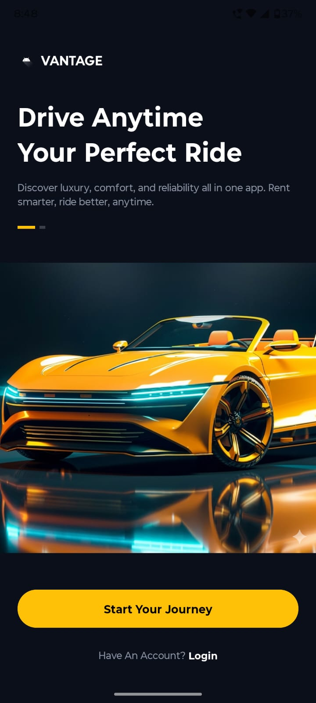</td>
<td>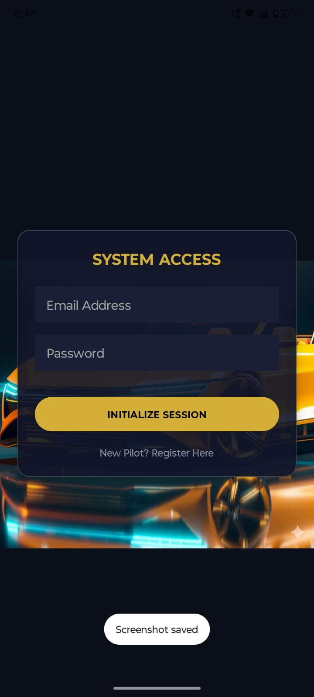</td>
</tr>

<tr>
<td>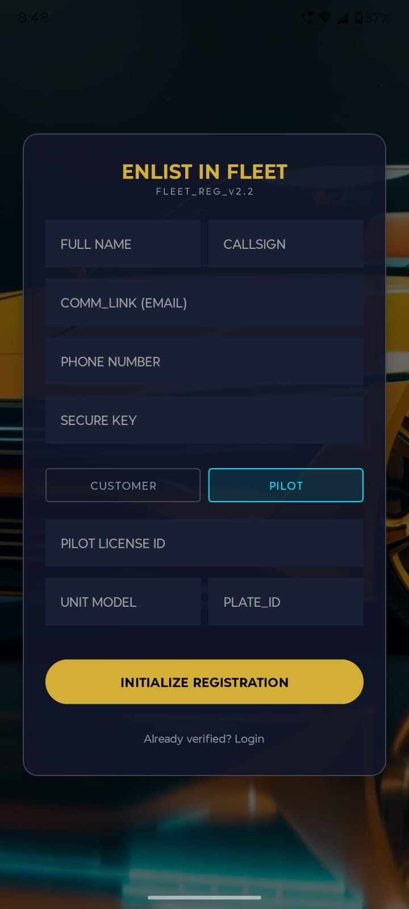</td>
<td>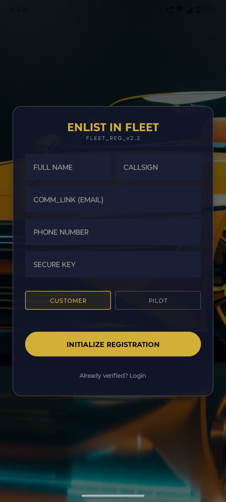</td>
</tr>

<tr>
<td>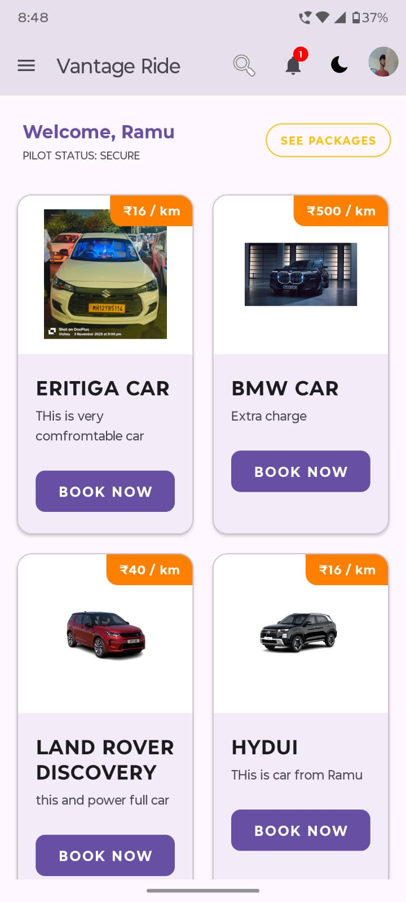</td>
<td>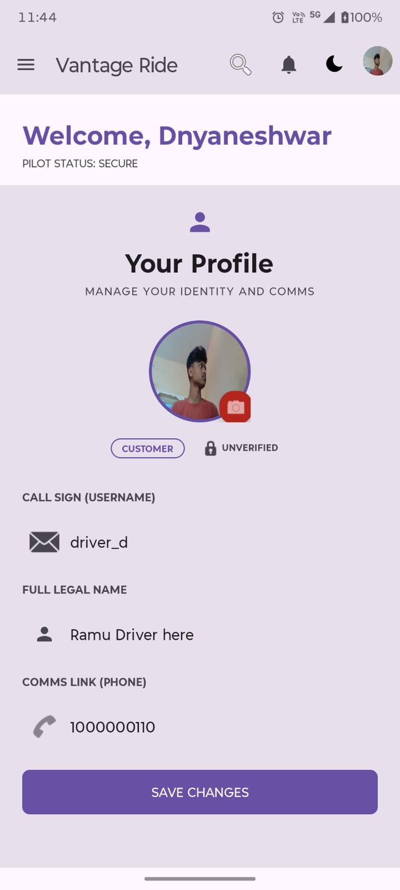</td>
</tr>

<tr>
<td>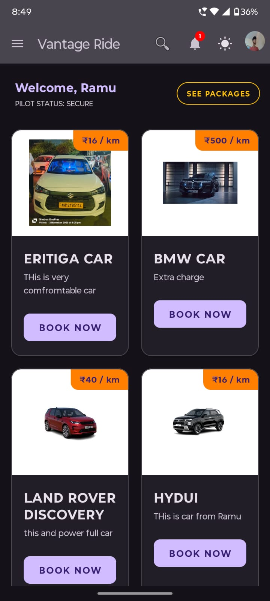</td>
<td>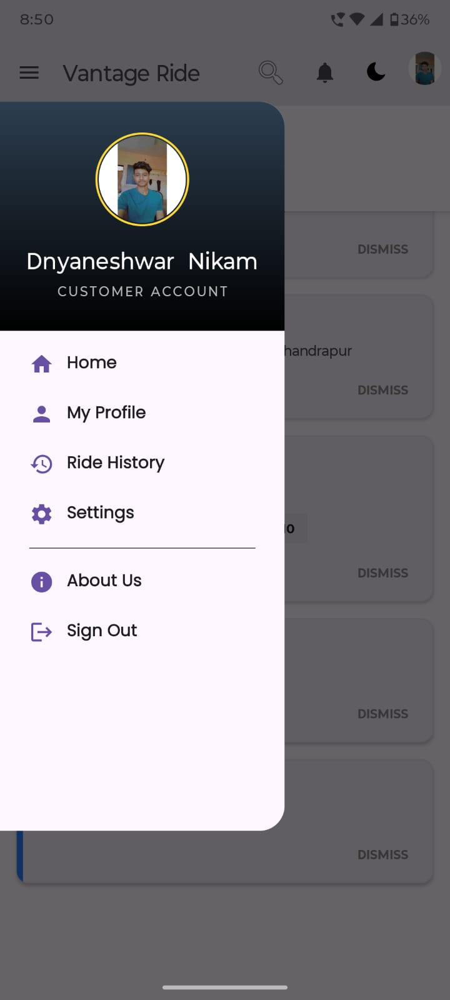</td>
</tr>

<tr>
<td>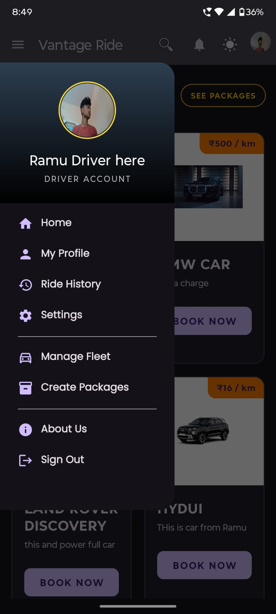</td>
<td>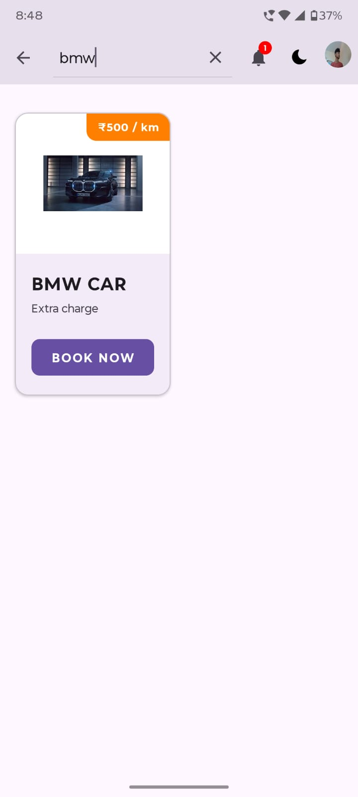</td>
</tr>

<tr>
<td>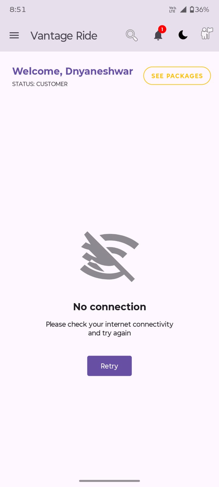</td>
<td>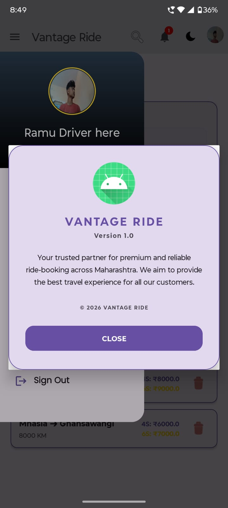</td>
</tr>

<tr>
<td>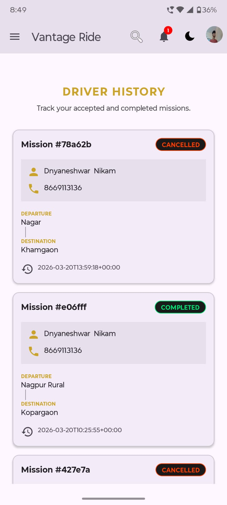</td>
<td>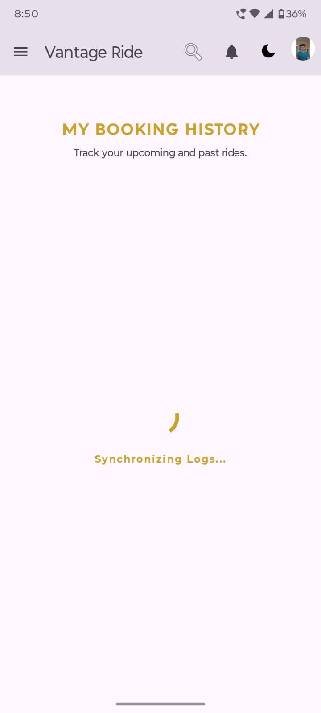</td>
</tr>

<tr>
<td>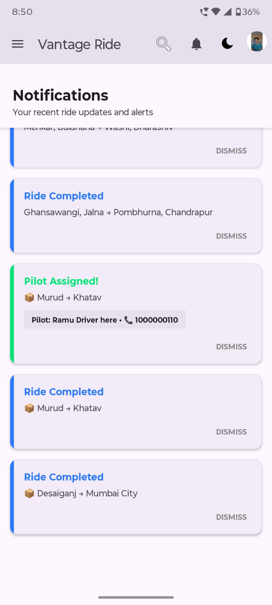</td>
<td>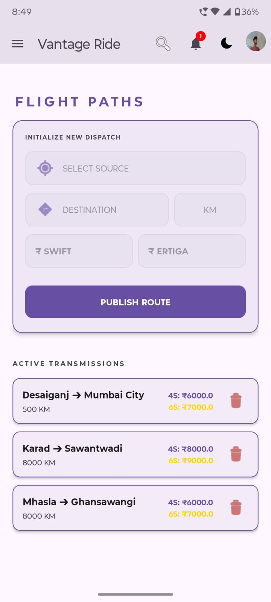</td>
</tr>

<tr>

<td>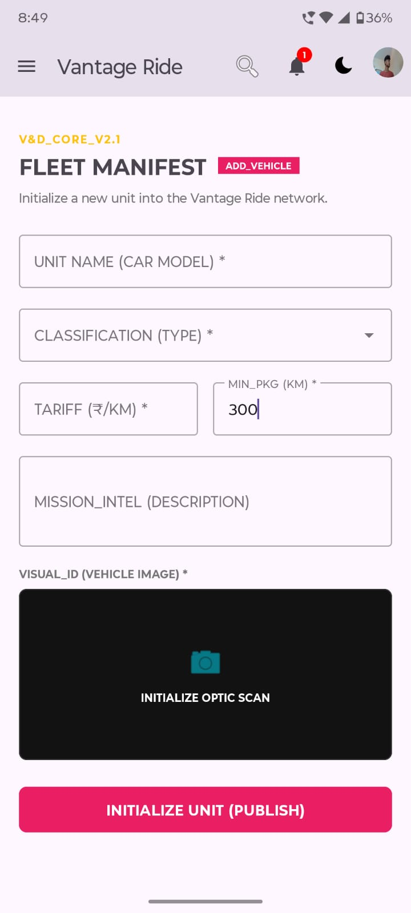</td>
</tr>
</table>

---

## System Design Insight

This project demonstrates:

* Separation of frontend and backend
* Reusable backend across platforms
* Scalable architecture
* Multi-role system handling (RBAC)
* Cross-platform data consistency

---

## Installation

Clone the repository
git clone https://github.com/Dnyanunik/vantage_ride_AndroidApp.git

Go to project folder
cd project-folder

Open the project in Android Studio

---

## Database Configuration

Create a file: SupabaseConfig.java

Add your credentials:

public class SupabaseConfig {
public static final String URL = "[https://your-project-id.supabase.co](https://your-project-id.supabase.co)";

public static final String ANON_KEY = "your-anon-key";
}

Replace with your actual Supabase URL and API key

---

## Run Application

Sync Gradle
Run the app on emulator or device

---

## Conclusion

Building a system where an Angular web application and a native Android app work together seamlessly has been a valuable experience in **system design, backend integration, and UI/UX optimization**.

---

